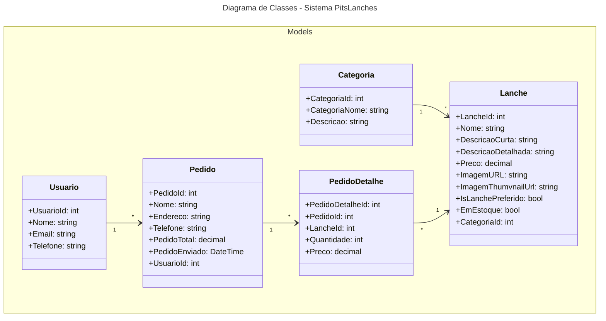

# Fábrica de Software 2025

Curso de Engenharia de Software 

Nome da equipe: Wellington Grein

Repositorio de desenvolvimento: https://github.com/WellingtonGrein/PitsLanchesPcCasa
# Propostas de projeto

### - Site de Venda de Lanches  
* RF01 - Cadastro de Usuário
* RF02 - Login e Autenticação
* RF03 - Cadastro de Produtos
* RF04 - Edição de Produtos
* RF05 - Listagem de Produtos
* RF06 - Filtro de Produtos por Categoria
* RF07 - Adicionar Item ao Carrinho
* RF08 - Remover Item do Carrinho	
* RF09 - Visualizar Carrinho
* RF10 - Finalizar Pedido
* RF11 - Favoritar Produtos
* RF12 - Visualizar Produtos Favoritos
* RF13 - Histórico de Pedidos
* RF14 - Geração de Relatório de Vendas
* RF15 - Gestão de Estoque
* RF16 - Administração de Usuários

      
## Histórias de usuário
   * Eu como cliente, gostaria de me cadastrar no site
   * Eu como cliente, gostaria de fazer login no site
   * Eu como cliente, gostaria de visualizar todos os produtos
   * Eu como cliente, gostaria de filtrar produtos por categoria
   * Eu como cliente, gostaria de adicionar um item ao carrinho
   * Eu como cliente, gostaria de remover itens do carrinho
   * Eu como cliente, gostaria de finalizar um pedido
   * Eu como cliente, gostaria de ver meu histórico de pedidos
   * Eu como funcionário, gostaria de realizar o cadastro de itens*
   * Eu como funcionário, gostaria de editar produtos existentes
   * Eu como funcionário, gostaria de gerenciar o estoque
   * Eu como funcionário, gostaria de visualizar relatório de vendas
   * Eu como funcionário, gostaria de gerenciar usuários do sistema
   * Eu como funcionário, gostaria de favoritar um item

     

